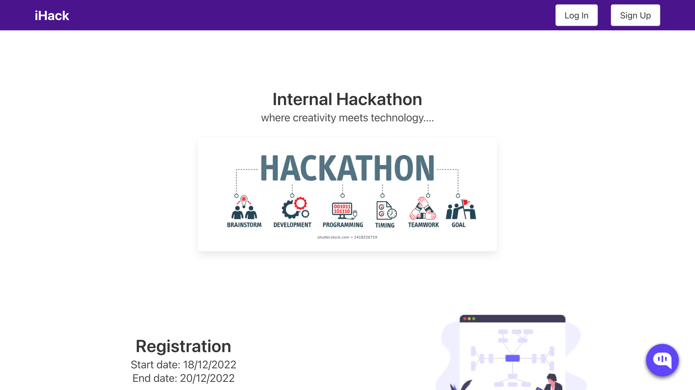
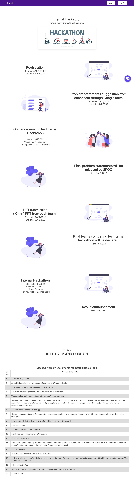
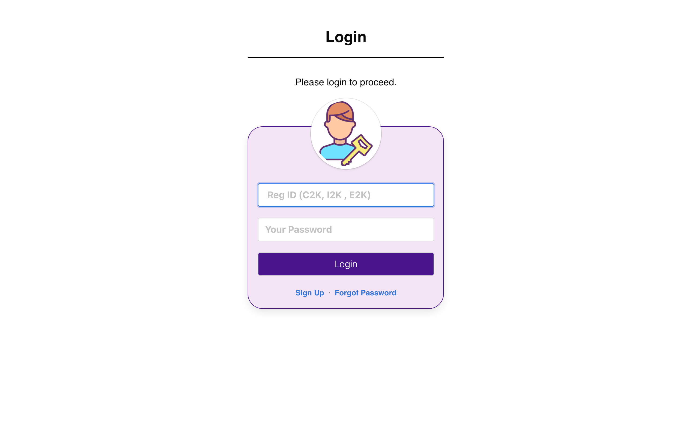
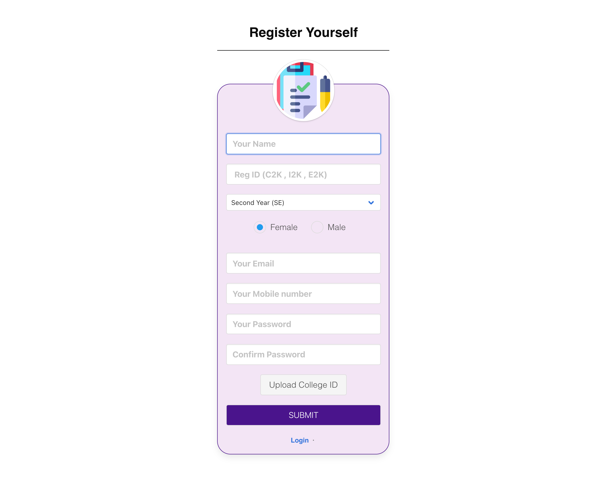
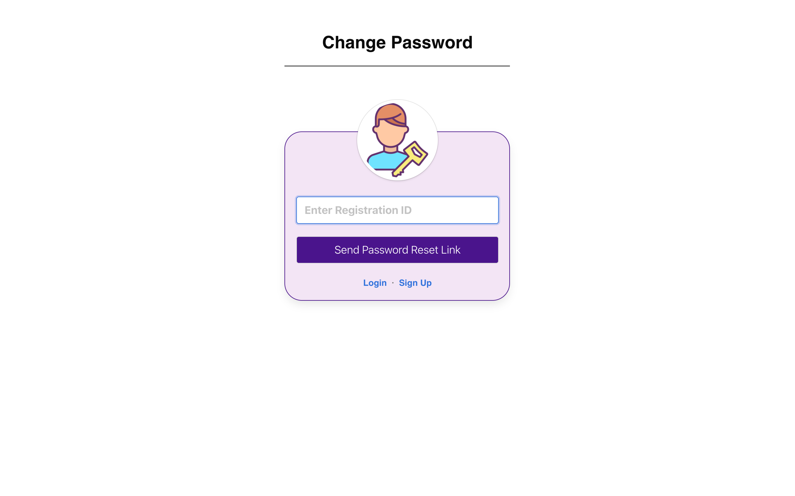

# PICT Internal Hackathon — Web App

**🌐 Live app: https://pict-internal-hackathon.onrender.com**

A web application to run an internal hackathon: participants sign up, log in, create or
join teams, submit their idea/presentation, and organisers manage the event. Built with
Node.js, Express and MongoDB.

> ℹ️ The original Heroku deployment (`ihack2020.herokuapp.com`) is gone — Heroku retired
> its free tier in November 2022 — so the app is now hosted **free on Render** (with a
> free MongoDB Atlas database). See **[Deploy for free on Render](#deploy-for-free-on-render)**
> to spin up your own copy. The live instance sleeps after ~15 min idle, so the first
> request may take ~30–60 s to wake.



## Features

- **Auth** — signup, login, logout with JWT stored in an HTTP cookie
- **Password reset** — email-based forgot/change password flow
- **Teams** — create a team, join via email invite, leave/remove members
- **Submissions** — upload a presentation (PPT) per team
- **Dashboard** — participant dashboard and evaluation views

## Screenshots

| Landing | Login |
| :---: | :---: |
| [](docs/screenshots/landing.png) | [](docs/screenshots/login.png) |
| Event timeline & problem statements | Register-ID + password sign-in |

| Sign up | Forgot password |
| :---: | :---: |
| [](docs/screenshots/signup.png) | [](docs/screenshots/forgot.png) |
| Participant registration with college-ID upload | Email-based password reset |

> Screenshots above are the public pages. Logged-in views (dashboard, team management,
> PPT submission) will be added here.

## Tech stack

| Layer    | Tech |
| -------- | ---- |
| Runtime  | Node.js (18–20) |
| Server   | Express 4 |
| Database | MongoDB via Mongoose |
| Views    | EJS-rendered `.html` templates in `public/` |
| Auth     | JSON Web Tokens (`jsonwebtoken`) + `cookie-parser` |
| Email    | Nodemailer (Gmail) |
| Uploads  | `express-fileupload` + AWS S3 (`aws-sdk`) |

## Project structure

```
app.js            Express app setup, Mongo connection, server start
routes/           Route definitions (root, account, fetch, team, file)
controllers/      Request handlers
models/           Mongoose models (User, Team)
middleware/       JWT auth guard
utils/            Encryption helpers
public/           HTML views, CSS, JS, images (served statically)
```

## Run locally

Prerequisites: **Node.js 18–20** and a MongoDB database (local, or a free
[MongoDB Atlas](https://www.mongodb.com/atlas) cluster).

```bash
git clone https://github.com/shadabshaikh0/PICT-Internal-Hackathon.git
cd PICT-Internal-Hackathon
npm install
cp sample-env .env      # then edit .env — see the table below
npm start
```

Open http://localhost:8080.

### Environment variables

| Variable           | Required | Notes |
| ------------------ | :------: | ----- |
| `MONGODB_URI`      | ✅ | MongoDB connection string. |
| `SESSION_SECRET`   | ✅ | **Exactly 32 characters** — used for both JWT signing and AES-256 encryption. |
| `BASE_URL`         | ✅ | App base URL, used to build password-reset links (e.g. `http://localhost:8080`). |
| `PORT`             | ⛅ | Defaults to `8080`. Hosting platforms set this automatically. |
| `NODEMAILER_EMAIL` | ⬜ | Gmail address for outgoing mail (password-reset / confirmation). |
| `NODEMAILER_PASS`  | ⬜ | Gmail **app password** for the above account. |
| `AWSID`            | ⬜ | AWS access key ID — only if using S3 PPT uploads. |
| `AWSSECRET`        | ⬜ | AWS secret access key — only if using S3 PPT uploads. |

✅ required · ⛅ auto-set by host · ⬜ optional (feature-specific). The app boots without
the optional vars; only the matching feature (email / S3 uploads) is disabled.

## Deploy for free on Render

This repo includes a [`render.yaml`](render.yaml) Blueprint, so most of the setup is
automatic. You'll need two free accounts: **MongoDB Atlas** (database) and **Render** (host).

### 1. Create a free MongoDB database (Atlas)

1. Sign up at [mongodb.com/atlas](https://www.mongodb.com/atlas) and create a **free M0**
   cluster.
2. **Database Access** → add a database user (username + password).
3. **Network Access** → add IP `0.0.0.0/0` (allow from anywhere — Render's IPs are dynamic).
4. **Connect** → **Drivers** → copy the connection string. It looks like:
   `mongodb+srv://<user>:<password>@cluster0.xxxxx.mongodb.net/hackathon?retryWrites=true&w=majority`
   (replace `<user>`/`<password>`, and add a db name like `hackathon` before the `?`).

### 2. Deploy on Render

1. Sign up at [render.com](https://render.com) and connect your GitHub account.
2. **New +** → **Blueprint** → select this repository. Render detects `render.yaml`.
3. When prompted, set the environment variables:
   - `MONGODB_URI` — the Atlas string from step 1
   - `SESSION_SECRET` — any **32-character** string
     (e.g. run `openssl rand -hex 16` → 32 hex chars)
   - `BASE_URL` — your Render URL, e.g. `https://pict-internal-hackathon.onrender.com`
     (you can set a placeholder first, then update it once Render assigns the URL)
4. Click **Apply** / **Create**. Render runs `npm install` then `npm start`.
5. Open the assigned `*.onrender.com` URL — the login page should load.

> **Note:** Render's free web service **spins down after ~15 minutes of inactivity**, so
> the first request after idle takes ~30–60 s to wake up. That's expected on the free plan.

## License

See repository. Originally bootstrapped from
[sahat/hackathon-starter](https://github.com/sahat/hackathon-starter).
